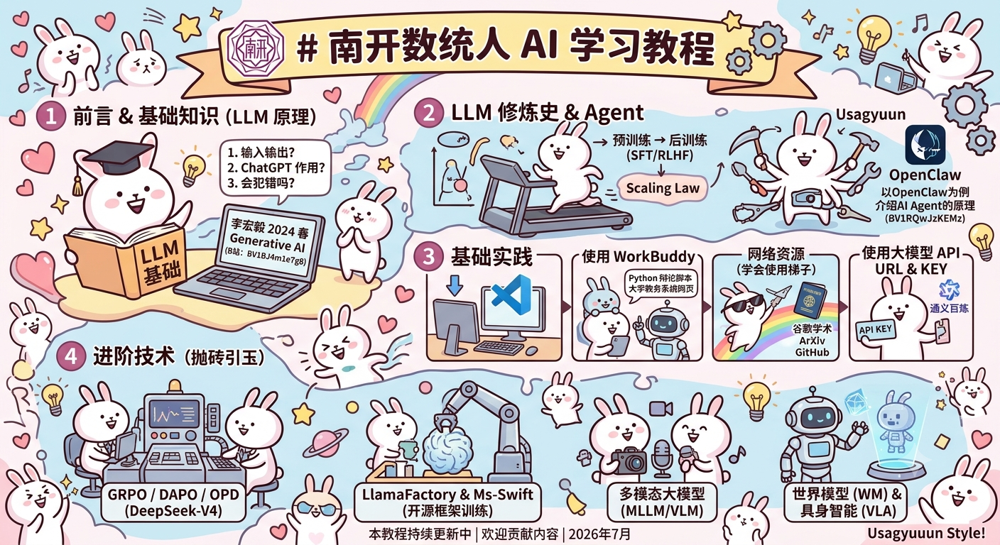
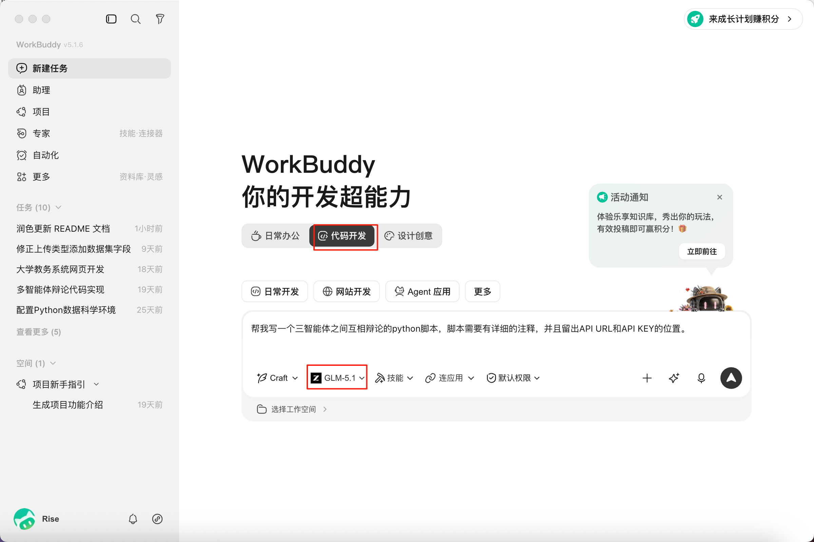
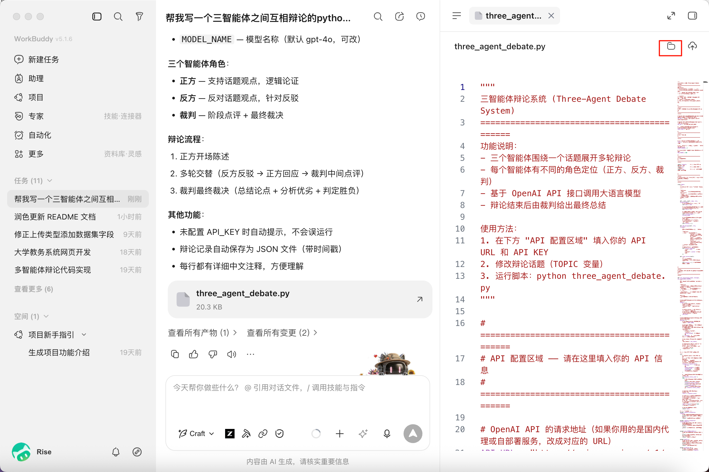
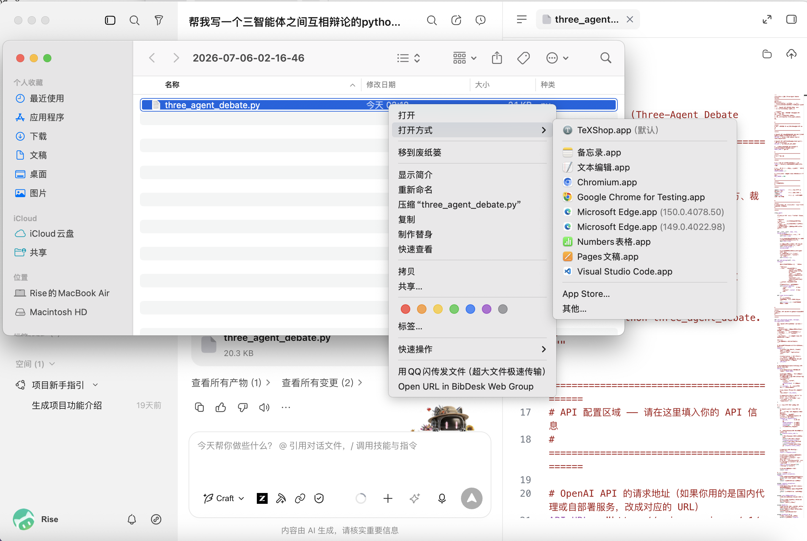
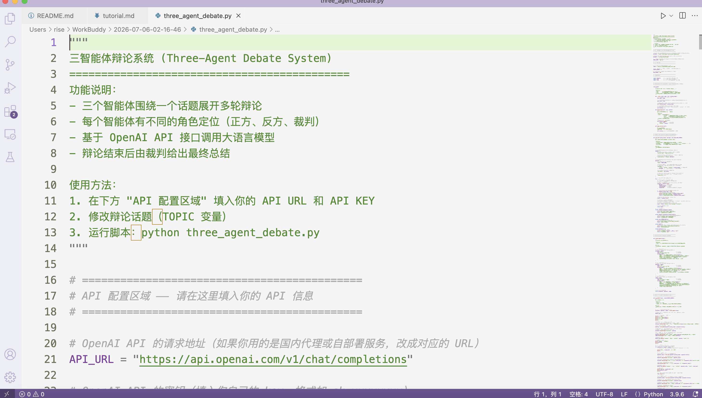
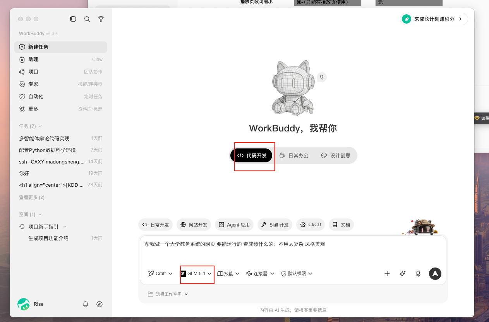
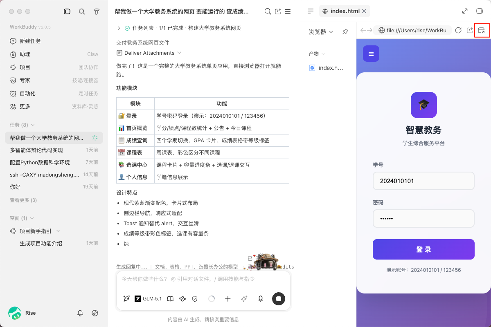
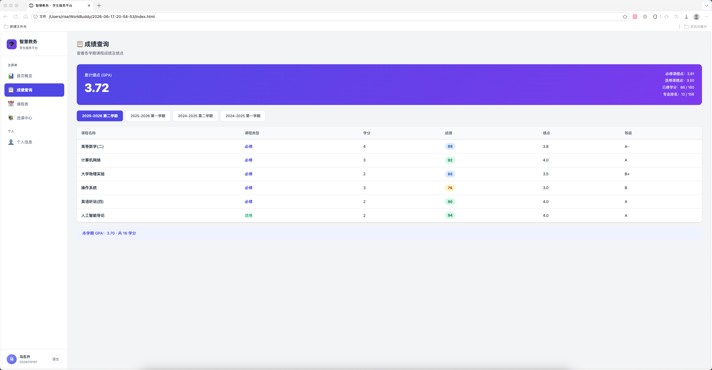
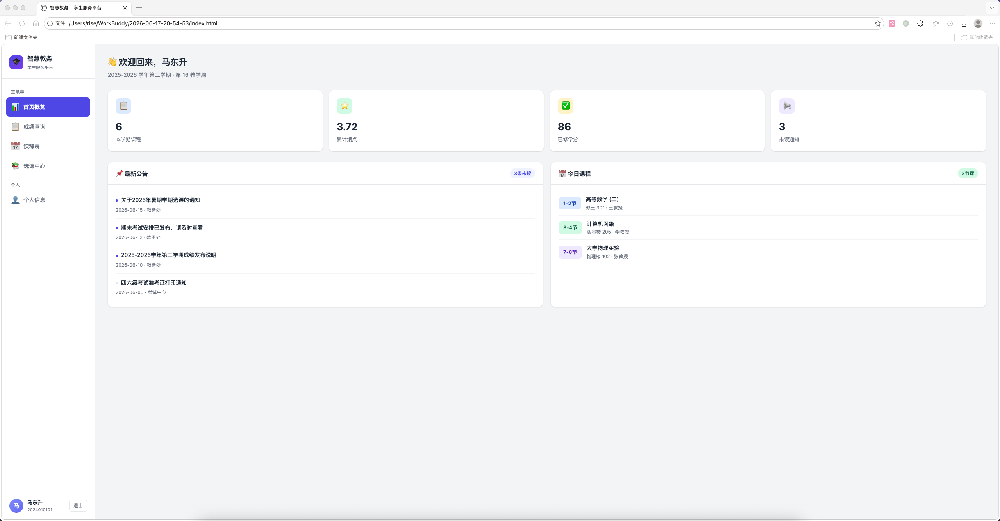

# 南开数统人 AI 学习教程

> 本教程持续更新中，欢迎贡献内容。可以通过联系作者、提出 Issue/PR 等各种方式进行贡献。

*本图由 nanobanana2 制作*

## 目录

- [前言](#前言)
- [基础知识](#基础知识)
- [基础实践](#基础实践)
- [进阶知识与技术](#进阶知识与技术)

---

## 前言

AI 有狭义和广义之分，对于初学者来说，我们不讲过多的历史。只需要知道：当下在就业市场，AI 几乎和大模型（LLM）算法可以划上等号。当然，未来你还会进一步接触到世界模型（World Model）、具身智能（VLA）等其他 AI 方向，但这些并不好上手和入门，因此本教程主要涉及的就是 LLM 算法。

本教程的核心内容是「基础知识」和「基础实践」两大板块，预计需要 7-8 小时的学习时间——其实并不多，大约相当于学校里 4-5 节课（每节 1.5 小时）的量。后续的进阶篇仅作抛砖引玉，不需要完整看完（不过其中「用开源框架进行模型训练」一节还是值得一看）。

## 基础知识

在这一阶段，我们主要通过一些视频课程教会你 LLM 最基础的原理。我们已经抛弃了在 2026 年用不到的一些技术，力求最快地让你入门。

我们从 **李宏毅 2024 春《生成式人工智能导论》** 开始学起。这部教程虽然在两年前，但其中很多内容和方法今天依然适用；而且很少涉及比较复杂的数学推导，又是国语授课，所以推荐大家从这里开始。

> 课程地址（B 站）：[BV1BJ4m1e7g8](https://www.bilibili.com/video/BV1BJ4m1e7g8)
>
> 课程 PPT：[speech.ee.ntu.edu.tw](https://speech.ee.ntu.edu.tw/~hylee/genai/2024-spring.php)（可能需要翻墙，后文会简要介绍这一技术）

这一部教程不需要你完全看完，我在这里列出其最重要的课程；其余的所有课程都是选看。依我的经验，作业课也不推荐大家去看。

- 第 1 讲：生成式 AI 是什么？（30 分钟）
- 第 2 讲：今日的生成式人工智能厉害在哪里？（30 分钟）

听完上述两节课，你应该能初步认识现在大模型工作的原理（而不是只会使用它）。为了方便大家检测，这里我出了几道概念题，大家可以自测一下（后续都会有这个环节）：

📝 自测题（点击展开）

1. LLM 的输入是什么，输出是什么？为什么能输出那么一大段话？
2. ChatGPT 能帮你干什么？
3. ChatGPT 会犯错吗？会说错话吗？

- 第 3 讲：训练不了人工智能吗？你可以训练你自己（上）（30 分钟）
- 第 4 讲：训练不了人工智能？你可以训练你自己（中）（45 分钟）
- 第 5 讲：训练不了人工智能？你可以训练你自己（下）（25 分钟）

由于第 5 讲所用的提示词方法和目前主流稍有脱节，所以如果时间不够的话，第 5 讲也可以选看。上完这几节课，大家应该会对大模型的一些简单技术具有初步的认识（包括提示词工程、工具调用等）。要注意，虽然在 2026 年回看这些技术都很粗糙，但它们是未来技术的基石。

📝 自测题（点击展开）

1. 什么是 CoT？为什么 CoT 会有用？
2. 问同一个问题，LLM 每次的输出都是一样的么？
3. LLM 是如何使用工具的呢？
4. 什么是 RAG？如何使用其增强语言模型？
5. 这几讲涉及到的方法，模型的"参数"是否有被改变？

- 第 6 讲：大型语言模型修练史 — 第一阶段：自我学习，累积实力（35 分钟）
- 第 7 讲：大型语言模型修练史 — 第二阶段：名师指点，发挥潜力（35 分钟）
- 第 8 讲：大型语言模型修练史 — 第三阶段：参与实战，打磨技巧（35 分钟）

这三讲的内容**非常重要**，涉及到了预训练、后训练等大模型训练全流程，目前业界的核心算法岗几乎都围绕着这些展开。只不过在 2026 年，后训练会加入不同的 RL 算法以及更先进的 OPD 算法（本教程后续会略微提到），以及数据更加多元丰富而已。

📝 自测题（点击展开）

1. 预训练的目的是什么？
2. Scaling Law 是什么？
3. SFT 中有什么技术可以让训练变得很快 / 只改变一部分参数？
4. RLHF 相对于 SFT，是更局部奖励还是更全局奖励？

- 第 10 讲：今日的语言模型是如何做文字接龙的 — 浅谈 Transformer

第 10 讲虽然是选看的，但我相信很多同学应该还是对 Attention 机制和 Transformer 很感兴趣（毕竟 *Attention is All You Need*！），所以也列在这里，如果你不想看也可以跳过。

- 第 9 讲：以大型语言模型打造的 AI Agent（25 分钟）

Agent 是大家必须要接触的另一个重要部分，因为现在很多公司都在招 Agent 应用开发岗，这可能是门槛比较低的第一份实习。除了这一讲之外，我们还会给大家补充最新的 Agent 技术，来自 **李宏毅 2026《机器学习》**：

> 课程地址：[BV1RQwJzKEMz](https://www.bilibili.com/video/BV1RQwJzKEMz)
>
> 课程 PPT：[speech.ee.ntu.edu.tw](https://speech.ee.ntu.edu.tw/~hylee/ml/2026-spring.php)

- 以 OpenClaw 为例介绍 AI Agent 的原理（1 小时 30 分钟）

📝 自测题（点击展开）

1. Agent 可以帮你干什么事？
2. OpenClaw 等 Agent 用什么方式管理"记忆"？
3. OpenClaw 等 Agent 强大的原因是什么？

到这里，我们应该已经花费了约 5 个小时的时间来听课程。这些课程听完，相信你已经对 LLM / Agent 相关技术有了初步的了解。接下来会进入实践课程，需要你上手操作。

## 基础实践

### 1. 下载 VSCode

做算法，需要一个编程环境；而现在程序员最常用的就是 VSCode。

> 下载地址：[code.visualstudio.com](https://code.visualstudio.com/Download)（即使不连梯子也挺快的）

注意需要选择适合自己机器的版本。这里放上 B 站教程，只需要看第一讲（安装）和第二讲（新建目录文件、选择解释器）即可：[BV1SA4y197dF](https://www.bilibili.com/video/BV1SA4y197dF)。

### 2. 学会使用高级 Agent

本教程以 WorkBuddy 为例（原因：WorkBuddy 免费且容易安装下载，后续你可以切换为 Codex 或者 Claude Code 等工具）。

> 下载地址：[codebuddy.cn/work](https://www.codebuddy.cn/work)（右上角下载），简单安装后用微信登录。

学会用 WorkBuddy 帮你做两个编程任务：

🔧 任务一：三智能体辩论脚本（点击展开详细流程，见图2-图5）

帮我写一个三智能体之间互相辩论的 Python 脚本，脚本需要有详细的注释，并且留出 API URL 和 API KEY 的位置。

选用代码开发和 GLM-5.1 模型：

完成后点击右上角打开文件夹：

注意一定要选用 VSCode 打开，然后你就可以在完全不写代码的情况下完成这个工作（当然还需要获取 API URL 和 KEY，这个后续会说）：

VSCode 打开效果：

🔧 任务二：大学教务系统网页（点击展开详细流程，见图6-图9）

帮我做一个大学教务系统的网页，要能运行的，查成绩什么的，不用太复杂，风格美观。

流程样例（此任务可能稍微有点复杂，需要多等一会）：

点击右上角打开网页：

这样你就在不会写一行前端代码的基础上，完成了自己的网页设计（还可以继续修改）：

 

**从你完成这两个例子开始，LLM 就替代我成为你的新老师了；后续教程中有任何疑惑和不会的，都可以问你的 WorkBuddy 老师！**

### 3. 学会使用梯子 / 翻墙 / VPN

国内大部分网络是不能直接访问外网的，但外网上又有很多值得学习、使用的资源（如谷歌学术、HuggingFace 等），这时候就需要用到这个技术。这一技术实在不适合公开传播，所以可以询问高年级学长获得。

同时，你还需要学会用谷歌学术、ArXiv 等网站查看论文原文（当然用小红书查看论文介绍也很不错！）；你必须要学会使用 GitHub 进行代码管理（简单教程见 [BV1hS4y1S7wL](https://www.bilibili.com/video/BV1hS4y1S7wL)，你也可以跟着 WorkBuddy 自学）。

### 4. 学会使用大模型 API URL 和 KEY

这一点推荐阿里的通义百炼：[aliyun.com/product/bailian](https://www.aliyun.com/product/bailian)，可以根据教程，用一些免费 / 便宜的模型体验一下。

## 进阶知识与技术

从这里开始，我们进入进阶的部分，会讲得较为简略，因为已经默认你拥有基础的知识和实践能力。对于我们所提及的文章，如果你真的读不懂，可以让 WorkBuddy 给你各种解释（举例 / 老奶奶都能听懂……）。

由于笔者是做多模态大模型的，所以不可避免地受到自己领域的影响，后续的进阶知识期待大家一起补充、更新！

### 1. 模型训练：GRPO 技术

GRPO 是 DeepSeek-R1 使用的后训练技术，在 2025 年一度非常热门，是后续 AgenticRL 技术的基础，有必要了解。

- 入门视频：[BV1EEP6zTEWu](https://www.bilibili.com/video/BV1EEP6zTEWu)（可以从第九分钟开始看，前面略啰嗦）
- 博客：[GRPO 到 DAPO 和 GSPO](https://hugging-face.cn/blog/NormalUhr/grpo-to-dapo-and-gspo)
- 论文：[DAPO](https://arxiv.org/abs/2503.14476)（不建议看 GRPO 的原始论文）

### 2. 实践技术：用开源框架进行模型训练

比较常用的 SFT 训练框架为 LlamaFactory：[GitHub 仓库](https://github.com/hiyouga/LlamaFactory/tree/main)，安装后你可以使用其 WebUI 页面进行训练，相当适合初学者（可以看首页的视频以及一些案例，如 [DeepSeek-R1-Distill-7B 训练示例](https://gallery.pai-ml.com/#/preview/deepLearning/nlp/llama_factory_deepseek_r1_distill_7b)）。

比较常用的 RL / GRPO 框架为 [Ms-Swift](https://github.com/modelscope/ms-swift)，它有比较好的[中文文档](https://swift.readthedocs.io/zh-cn/latest/)，里面的 GRPO 讲得也是比较详细，并且 Best Practices 也非常好，建议多参考多实践。

当然，还有很多其他优秀的开源框架可以使用，如 [Verl](https://github.com/verl-project/verl) 等，限于篇幅，读者可以自行探索。

当然，你还会遇到没有显卡的问题，可以使用 Google Colab 或者 Kaggle 上的免费显卡进行操作。

### 3. 模型训练：AgenticRL / AgenticRAG

如何把 GRPO 等 RL 算法，切切实实地用来提升模型的能力？AgenticRL 算法给出了一个回答。

- 论文：[Search-R1](https://arxiv.org/abs/2503.09516)
- 论文：[WebDancer](https://arxiv.org/abs/2505.22648)
- 博客：[通义 DeepResearch](https://tongyi-agent.github.io/zh/blog/introducing-tongyi-deep-research/)
- 论文：[DeepEyes](https://arxiv.org/abs/2505.14362)

### 4. 模型训练：OPD 技术

在 2026 年，社区发现 OPD 技术可以融合多个教师模型的优点，于是开始广泛使用在后训练中。

- 论文：[OPSD](https://arxiv.org/abs/2601.18734)
- 技术报告：[DeepSeek-V4](https://arxiv.org/abs/2606.19348)（第五章）

### 5. 技术方向：多模态大模型（MLLM / VLM）

LLM 显然不能满足人们对于模型的需要，因此社区开始探索多模态的输入（MLLM / VLM）和多模态的输出（UMM / OMNI），但前者目前较为成熟。

- 技术报告：[Qwen3-VL](https://arxiv.org/abs/2511.21631)
- 技术报告：[MinerU 2.5](https://arxiv.org/abs/2509.22186)

### 6. 技术方向：世界模型（WM）& 具身智能（VLA）

前沿方向，笔者也不太熟悉，放几篇公认的文章供大家学习。

- 网页：[Matrix-Game 3.0](https://github.com/SkyworkAI/Matrix-Game/tree/main/Matrix-Game-3)
- 论文：[VL-JEPA](https://arxiv.org/abs/2512.10942)
- 论文：[VLA](https://arxiv.org/abs/2505.04769)

---
